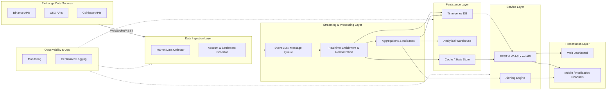

# High-Level System Architecture

## Layer Responsibilities

### Data Ingestion Layer
- Maintain exchange-specific connectors for both public market data streams and authenticated account feeds.
- Handle retry, reconnection, and rate-limit backoff strategies.
- Normalize raw payloads into internal schemas before publishing to the event bus.

### Streaming & Processing Layer
- Central message bus (e.g., Kafka, Redpanda) buffers high-volume events.
- Streaming jobs standardize timestamps, enrich symbols, and compute derived metrics (VWAP, funding rates, exposure).
- Stateful processors maintain rolling aggregates required for alerts.

### Persistence Layer
- Time-series database (TimescaleDB, InfluxDB) stores tick-level and candle data with retention policies.
- Analytical warehouse (Snowflake, BigQuery, ClickHouse) persists historical aggregates for ad-hoc analysis.
- Low-latency cache (Redis, Materialize) supports real-time API queries and alert state.

### Service Layer
- Unified API provides normalized REST endpoints and push-based WebSocket feeds to downstream consumers.
- Alerting engine evaluates thresholds/conditions and triggers notifications via messaging channels (Slack, email, PagerDuty).

### Presentation Layer
- Web dashboard visualizes live market depth, PnL, and portfolio exposure.
- Mobile/web notification channels surface alerts and anomaly detection outputs.

### Observability & Operations
- Centralized logging captures ingestion, processing, and service metrics for debugging.
- Monitoring (Prometheus/Grafana) tracks system health and SLA adherence.
- Incident response playbooks tie into alerting to ensure operational readiness.
